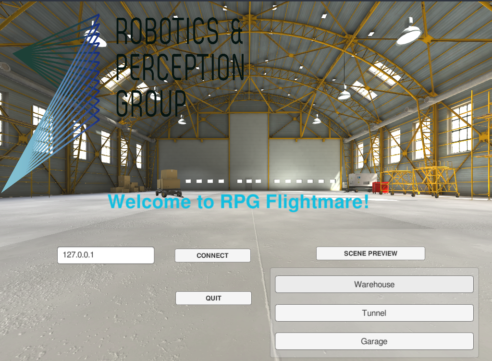

# RPG Flightmare Unity

RPG Flightmare Unity is a [Unity](https://unity.com/) project for building the photorealistic image renderering engine
of the [RPG Flightmare simulator](https://github.com/uzh-rpg/flightmare).   

# Getting started

---

Read the [WIKI](https://github.com/uzh-rpg/rpg_flightmare_unity/wiki) for [installation](https://github.com/uzh-rpg/rpg_flightmare_unity/wiki/Installation-Guide), [usage](https://github.com/uzh-rpg/rpg_flightmare_unity/wiki/Usage-Guide) and [developer](https://github.com/uzh-rpg/rpg_flightmare_unity/wiki/Developer-Guide) guide.

# Acknowledgements

This project is inspired by [FlightGoggles](https://github.com/mit-fast/FlightGoggles), we use some components from FlightGoggles. 
